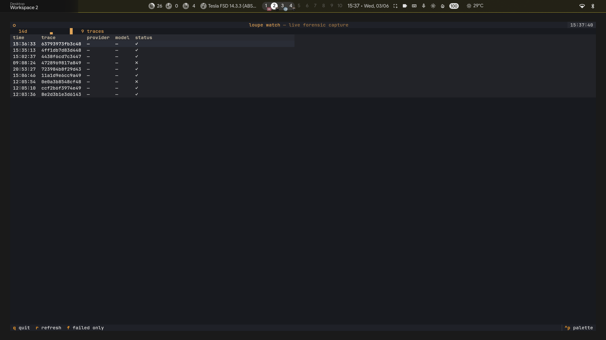
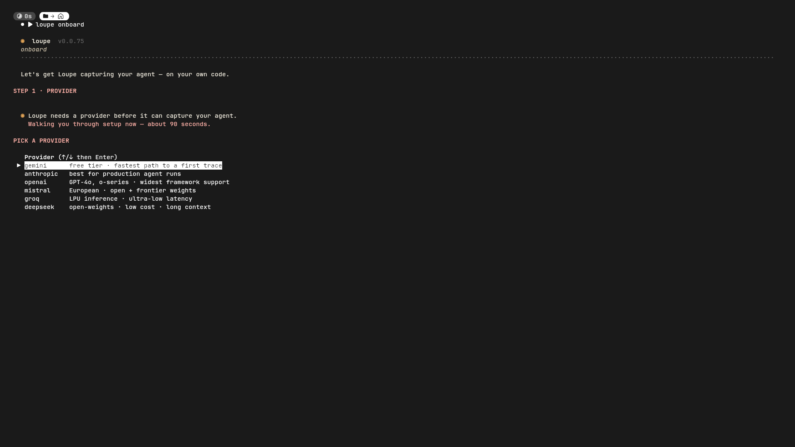
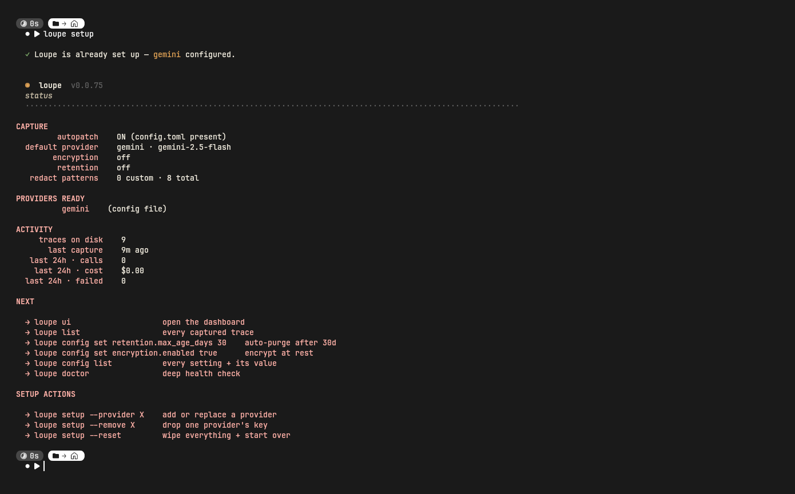
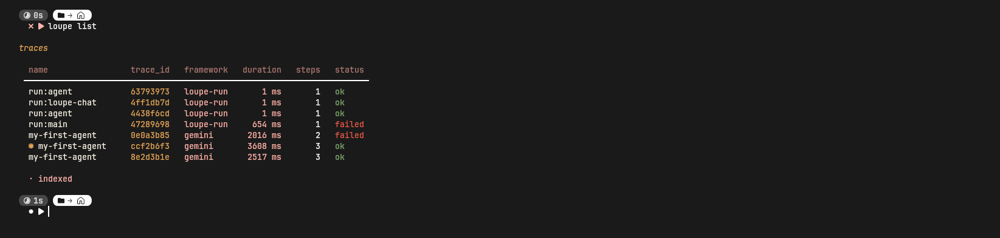
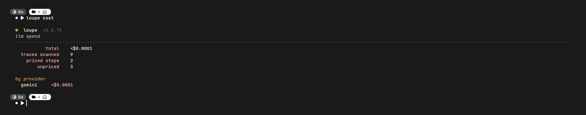
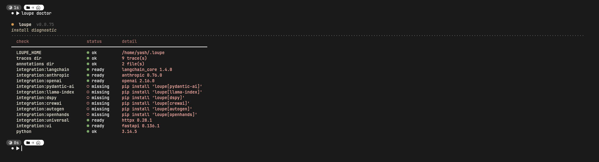
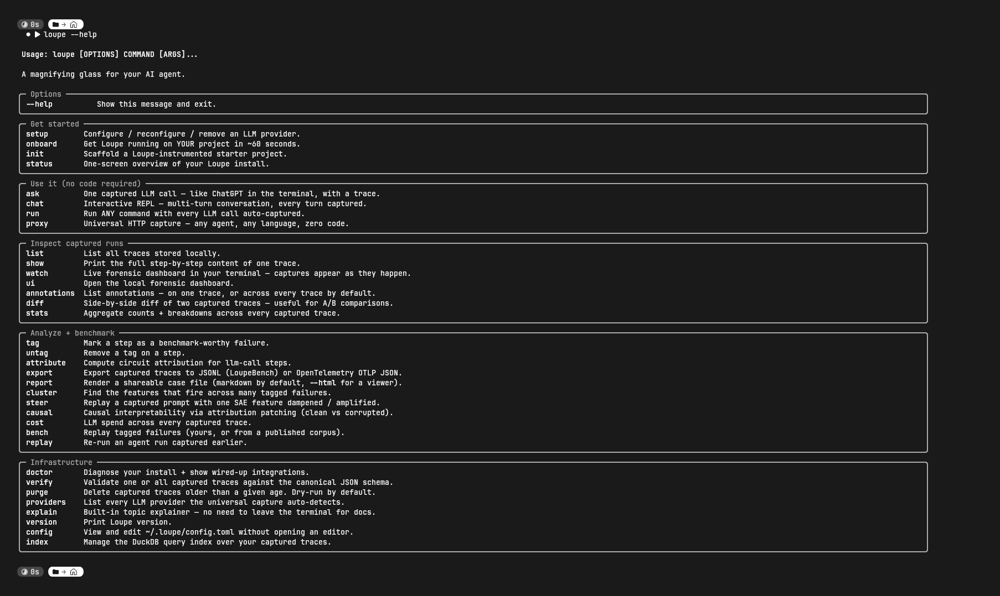
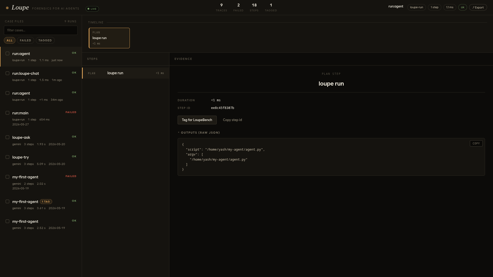
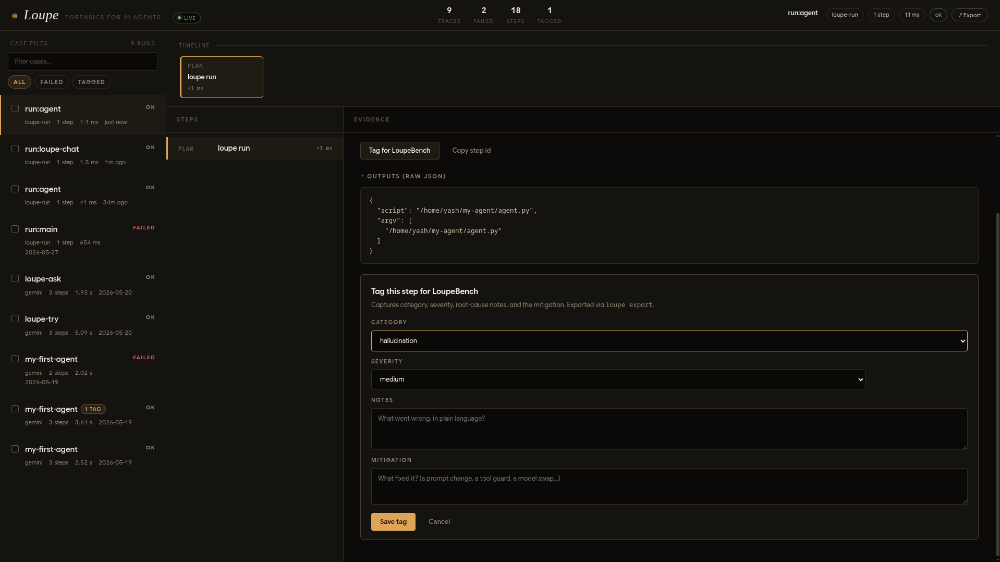

<div align="center">

# Loupe

**A magnifying glass for your AI agent.**

Open-source forensic observability + interpretability for LLM agents.<br>
Captures every LLM call your code makes — *zero* code changes — and tells you exactly *why* it went wrong.

[](https://pypi.org/project/loupe-ai/)
[](https://www.npmjs.com/package/loupe-ai)
[](https://github.com/YashwanthKamireddi/loupe/actions/workflows/ci.yml)
[](LICENSE)
[](#)

</div>

<p align="center">
  
</p>

<p align="center"><sub><code>loupe watch</code> — live capture of every LLM call your agent makes, in your terminal.</sub></p>

---

## Why Loupe

Modern agents call dozens of LLM endpoints per task. When they fail — a hallucinated selector, a runaway retry, a quiet 429 — there is no flight recorder. You stare at the logs and guess.

**Loupe is the flight recorder.** One env var. Every provider. Every framework. Every language. Every step prompt + reply + tokens + latency + error captured to local JSONL, then explained at the level of *mechanism* via SAE feature attribution.

- **Zero code, every provider.** Patches `httpx` at the bottom — OpenAI, Anthropic, Gemini, Mistral, Groq, LangChain, CrewAI, OpenHands, browser-use, gpt-researcher: all captured uniformly with no integration code.
- **Two dashboards, same data.** A live in-terminal TUI (`loupe watch`) and a full browser forensic dashboard (`loupe ui`) — read the same JSONL store.
- **Interpretability, not just observability.** `loupe attribute --backend sae` surfaces the actual transformer features that fired during a failing step, via [sae-lens](https://github.com/jbloomAus/SAELens) + [Neuronpedia](https://neuronpedia.org).
- **Local-first.** Traces live in `~/.loupe/traces/`. No SaaS, no lock-in, no telemetry phoning home.
- **MIT, signed-provenance releases.** Both PyPI + npm publishes carry sigstore attestations bound to this repo.

## Install

```bash
pip install loupe-ai       # Python  →  loupe + dashboard + universal capture
npm  install loupe-ai      # Node    →  same wire format, same dashboard
```

That's it. The CLI, the FastAPI dashboard, the universal HTTP capture, and the JSONL store are all in the one package.

## 60-second quickstart

```bash
# 1. Configure one provider (~30s — arrow-key picker)
loupe setup

# 2. Run YOUR agent unchanged — Loupe captures it
LOUPE_AUTOPATCH=1 python my_agent.py

# 3. See what just happened
loupe watch       # live, in your terminal
loupe ui          # full forensic dashboard at localhost:7860
```

<p align="center">
  
  
</p>

No imports, no decorators, no per-provider integration. `LOUPE_AUTOPATCH=1` flips a `.pth`-loaded hook that wraps `httpx`; from that point every LLM call any Python process makes lands in `~/.loupe/traces/`.

## See what was captured

<table>
<tr>
<td width="50%" valign="top">

#### `loupe list` — every captured run



</td>
<td width="50%" valign="top">

#### `loupe cost` — actual spend, 14-day trend



</td>
</tr>
<tr>
<td width="50%" valign="top">

#### `loupe doctor` — install health



</td>
<td width="50%" valign="top">

#### `loupe --help` — the full command surface



</td>
</tr>
</table>

#### `loupe ui` — full forensic dashboard

<p align="center">
  
</p>

Every captured run gets a one-click case file: model, latency, tokens, the prompt the model saw, the reply it gave, the raw HTTP, and any error. Failures highlighted in red. SSE pushes new captures live — no refresh.

## Tag failures → LoupeBench

Loupe is built around a public benchmark of *why* agents fail. Click any step → **Tag for LoupeBench** → record category, severity, root cause, mitigation. Export with `loupe export` to get a CC-BY-4.0 JSONL ready for [bench/](bench/) PRs.

<p align="center">
  
</p>

## Circuit attribution — see *which features* fired

Tagging tells you **what** went wrong. `loupe attribute --backend sae` tells you **why** at the level of mechanism — the actual transformer features active during the failing step.

```bash
pip install 'loupe-ai[interp]'                     # torch + transformer-lens + sae-lens (~150 MB)
loupe attribute <trace-id> --backend sae --explain
```

```
step d3a6a09 top features:
  # 23123  act=420.087  phrases related to legal documents and rulings
  #   979  act=401.952  phrases related to privatized prison industry
  #   316  act=349.759  mentions of percentages or numerical values
  #  7496  act=329.776  phrases related to warning signs about alcohol
```

Real GPT-2-small features from Joseph Bloom's layer-6 residual SAE; explanations fetched live from [Neuronpedia](https://neuronpedia.org). Cluster across 100 tagged failures with `loupe cluster --category hallucination` and you have a publishable circuit characterization.

> **Honest caveat.** Closed frontier models (Claude, GPT-4) don't publish their SAEs. The workflow Loupe is built for: capture a closed-model agent, then attribute the same prompt through an open model that does. The features aren't literally what fired inside Claude — they're what an open model would use to produce a similar continuation. That correlation is what current mech-interp research relies on.

## Works with everything

| Layer | Loupe captures it via | Examples |
|---|---|---|
| **Provider SDKs** | universal httpx patch | OpenAI, Anthropic, Google GenAI, Mistral, Groq, Cohere, DeepSeek, Together, Perplexity, Ollama |
| **Frameworks** | same path (they all use httpx) | LangChain, LangGraph, CrewAI, DSPy, Pydantic-AI, LlamaIndex, AutoGen, OpenHands |
| **Real OSS agents** | tested end-to-end | [`browser-use`](https://github.com/browser-use/browser-use) (96.9k ★), [`gpt-researcher`](https://github.com/assafelovic/gpt-researcher) (27.5k ★) — see [`examples/`](examples/) |
| **Other languages** | `loupe proxy` (HTTP MITM) | Node, Go, Rust, Ruby, Java, curl |
| **TypeScript / Node** | `loupe-ai` npm package | Vercel AI SDK, Anthropic SDK, OpenAI SDK |
| **OTel ecosystem** | `loupe export --format otlp` | Datadog, Honeycomb, Jaeger, Tempo, Grafana, New Relic |

## Two languages, one wire format

Python and TypeScript SDKs write **identical JSONL** to `~/.loupe/traces/`. Both register the same step kinds (`llm-call`, `tool-call`, `thought`, `error`). The dashboard reads both transparently — your Next.js + Vercel AI SDK trace and your LangGraph notebook trace appear side-by-side.

```typescript
import { trace, recordStep } from "loupe-ai";

const myAgent = trace({ framework: "vercel-ai-sdk" }, async (q: string) => {
  recordStep("thought", "plan");
  return await generateText({ model, prompt: q });
});
```

Or zero-code, identical to Python:

```bash
LOUPE_AUTOPATCH=1 NODE_OPTIONS="--require loupe-ai/autopatch" node my-agent.js
```

## Architecture

```
                     ┌────────────────────┐
   your agent  ──►   │   httpx.AsyncClient│   ──►  any LLM provider
                     └─────────┬──────────┘
                               │  (Loupe wraps send/_send_async)
                               ▼
                ~/.loupe/traces/<trace_id>.jsonl   ◄── append-only, atomic
                               │
        ┌──────────────────────┼──────────────────────┐
        ▼                      ▼                      ▼
   loupe watch            loupe ui              loupe attribute
   (Textual TUI)        (FastAPI + SSE)        (sae-lens + torch)
```

- **JSONL wire format** — one trace per file, header on line 1, steps append-only. Spec in [`docs/SPEC.md`](docs/SPEC.md).
- **DuckDB index** — best-effort, falls back to JSONL walk if corrupted. `loupe list/stats` are O(1)-ish at any scale.
- **Daemon-free** — no background process. Capture is a function call in the wrapped httpx layer.

## Commands

```
Get started           loupe · setup · onboard · init · status
Use it (zero code)    ask · chat · run · proxy
Inspect               list · show · watch · ui · diff · stats
Tag + benchmark       tag · untag · annotations · attribute · cluster · steer · causal · export · report · bench · cost · replay
Infrastructure        doctor · verify · purge · index · config · providers · explain · version
```

Run `loupe --help` for the full surface; `loupe explain <topic>` for any concept (`trace`, `autopatch`, `attribution`, …).

## Releasing

Every `v*.*.*` tag fires a workflow that runs the full gauntlet (596 Python + 44 TS tests, version-parity, tag↔package match) and publishes to **both** registries with signed provenance. See [`RELEASING.md`](RELEASING.md).

## Roadmap

- **v0.1** — Loupe Cloud (hosted dashboard sync, optional; keeping local-first as the default)
- **LoupeBench v0.1** — 1k curated annotated failures, public CC-BY-4.0 release

## Built on

[SAELens](https://github.com/jbloomAus/SAELens) · [Neuronpedia](https://www.neuronpedia.org) · [LangChain](https://github.com/langchain-ai/langchain) · [Textual](https://textual.textualize.io) · [FastAPI](https://fastapi.tiangolo.com) · [DuckDB](https://duckdb.org) · [Typer](https://typer.tiangolo.com) · [Rich](https://github.com/Textualize/rich)

## License

MIT — see [`LICENSE`](LICENSE). Use it. Fork it. Ship it.

---

<div align="center">
<sub>Loupe is open research. If you work on agent observability, mech interp, or eval — please <a href="https://github.com/YashwanthKamireddi/loupe/issues/new">open an issue</a> and say hi.</sub>
</div>
